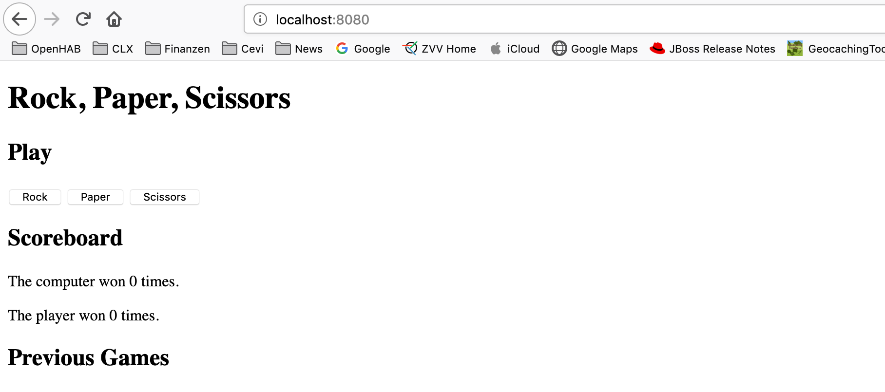

# Rock Paper Scissors Spring
A simple Rock Paper Scissors implementation with Spring Boot.

This simple project was created as a excercise in the workshop "Kotlin/Everywhere – Einstieg für Java Entwickler" at the [CH-OPEN](https://www.ch-open.ch/) [Workshop Days](https://workshoptage.ch/)

Slides and exercises of the workshop can be found [here](https://gitlab.com/nxt/public/kotlin/documentation/-/releases).

Start the application by invoking 
`gradlew bootRun`
